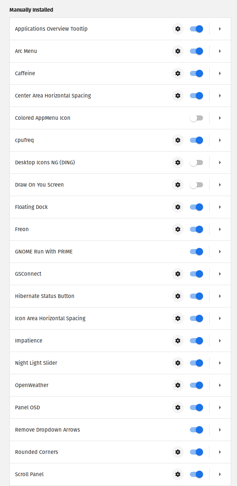
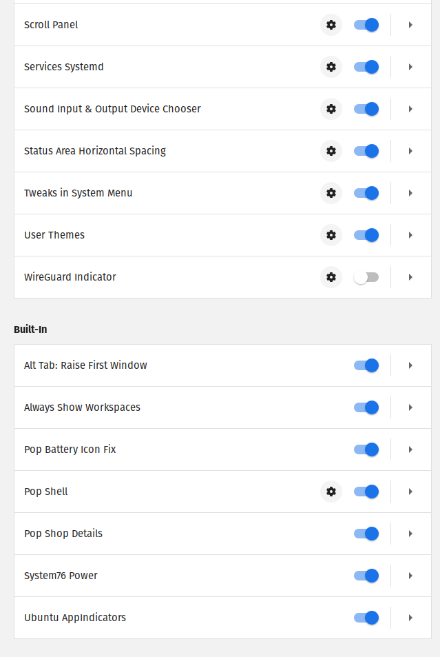

# Extensions installed

[Applications Overview Tooltip by RaphaelR](https://extensions.gnome.org/extension/1071/applications-overview-tooltip/)
[Arc Menu by LinxGem33](https://extensions.gnome.org/extension/1228/arc-menu/)
[Caffeine by eon](https://extensions.gnome.org/extension/517/caffeine/)
[Center Area Horizontal Spacing by kirby_33](https://extensions.gnome.org/extension/1075/center-area-horizontal-spacing/)
[Colored AppMenu Icon by yanbab](https://extensions.gnome.org/accounts/profile/yanbab)
