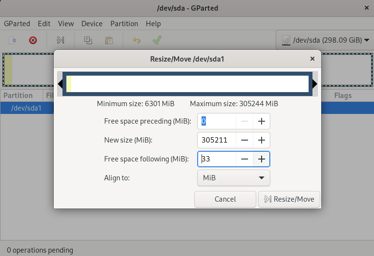

### Specifics
This is a guide to solve a very specific issue. I have shanked a couple of 14TB WD Elements USB drives and I wanted to re-purpose the USB enclosures, left over after taking the drives out.
I have a couple of 8TB Seagate Archive drives which I wanted ot put in there.
However, upon connection of the drive to the USB enclosure (the USB to SATA adapter), I was greeted with "empty space" and an error titled:

**GPT PMBR Size Mismatch**

This issue has many manifestations, but in my case, it was the following: 
The partition table inside the USB enclosure was reported a few MB shorter. As such the header was not accessible by the kernel, and the drive appeard empty. And everything complained.

# Recreating the issue

Here's a recreation of the issue. 

## On SATA
This drive has been partitioned and a filesystem has been created while connected on SATA:

~~~
[otheos@brahe ~]$ sudo fdisk -l /dev/sdc
Disk /dev/sdc: 298.09 GiB, 320072933376 bytes, 625142448 sectors
Disk model: ST3320820AS     
Units: sectors of 1 * 512 = 512 bytes
Sector size (logical/physical): 512 bytes / 512 bytes
I/O size (minimum/optimal): 512 bytes / 512 bytes
Disklabel type: gpt
Disk identifier: AE4876BF-118A-8042-940E-861EA1650EF3

Device     Start       End   Sectors   Size Type
/dev/sdc1   2048 625141759 625139712 298.1G Linux filesystem
~~~

Note that the available secors are **625142448**. 

Mounting this ext4 partition gives an output on ```dmesg``` of:

~~~
[ 4594.957324]  sdc: sdc1
[ 4715.916024] EXT4-fs (sdc1): mounted filesystem with ordered data mode. Quota mode: none.
~~~

Everything is fine!

Disconnect the drive from the SATA connector (a reboot is required to do that) and reconnect it with the USB Enclosure.

## On USB

Check with ```lsblk```:
~~~
[otheos@brahe ~]$ lsblk
NAME   MAJ:MIN RM   SIZE RO TYPE MOUNTPOINTS
sda      8:0    0 298.1G  0 disk 
~~~

The drive appears to have no partitions. 
Check with ```fdisk```:
~~~
[otheos@brahe ~]$ sudo fdisk -l /dev/sda
GPT PMBR size mismatch (625142447 != 625076223) will be corrected by write.
Disk /dev/sda: 298.06 GiB, 320039026688 bytes, 625076224 sectors
Disk model: Elements 25A3   
Units: sectors of 1 * 512 = 512 bytes
Sector size (logical/physical): 512 bytes / 512 bytes
I/O size (minimum/optimal): 512 bytes / 512 bytes
Disklabel type: dos
Disk identifier: 0x00000000

Device     Boot Start       End   Sectors   Size Id Type
/dev/sda1           1 625076223 625076223 298.1G ee GPT
~~~

**There it is!** Let me make it more obvious:

~~~
GPT PMBR size mismatch (625142447 != 625076223) will be corrected by write.
~~~

Also note that there does appear to be a partition, but the Start, End, Sectors, ID and Type are messed up. 
The kernel doesn't see a partition (as shown in ```lsblk```). 

**I can't fix this from here.***

## Identify the issue

However, notice the discrepancy: The disk when inside the enclosure reports **625076224** sectors (see end of line starting with ```/disk/sda```), while when connected internally (SATA) it reported **625142448**.
The mismatch is referenced clearly in the error message:
~~~
625142447 != 625076223
~~~

Note: Minus 1 for the first sector. 

So the drive appears smaller inside the enclosure by 625142447-625076223=**66224** sectors.
With a sector size of 512B, that's 66224x512=**33906688** bytes, or almost 33MB!

The kernel cannot access the header of the partition, typically stored at the end (I may be wrong about the specifics here, but I explain later why I think this is the case), so the drive is reported empty for most purposes. 
But it is **not empty**. So do not format/touch anything.

Instead, reconnect the drive internally on SATA.

## Fix the issue 

### Connected on SATA

Back to SATA and everything reports and works fine:

~~~
[otheos@brahe ~]$ lsblk
NAME   MAJ:MIN RM   SIZE RO TYPE MOUNTPOINTS
sda      8:0    0 298.1G  0 disk 
└─sda1   8:1    0 298.1G  0 part 
~~~

and:

~~~
[sudo] password for otheos: 
Disk /dev/sda: 298.09 GiB, 320072933376 bytes, 625142448 sectors
Disk model: ST3320820AS     
Units: sectors of 1 * 512 = 512 bytes
Sector size (logical/physical): 512 bytes / 512 bytes
I/O size (minimum/optimal): 512 bytes / 512 bytes
Disklabel type: gpt
Disk identifier: AE4876BF-118A-8042-940E-861EA1650EF3

Device     Start       End   Sectors   Size Type
/dev/sda1   2048 625141759 625139712 298.1G Linux filesystem
~~~

The solution is rather basic: **shrink the partition by 33MB**.
I use **gparted** for it.


After resizing, check with ```fdisk```:

~~~
[otheos@brahe ~]$ sudo fdisk /dev/sda -l
Disk /dev/sda: 298.09 GiB, 320072933376 bytes, 625142448 sectors
Disk model: ST3320820AS     
Units: sectors of 1 * 512 = 512 bytes
Sector size (logical/physical): 512 bytes / 512 bytes
I/O size (minimum/optimal): 512 bytes / 512 bytes
Disklabel type: gpt
Disk identifier: AE4876BF-118A-8042-940E-861EA1650EF3

Device     Start       End   Sectors   Size Type
/dev/sda1   2048 625074175 625072128 298.1G Linux filesystem
~~~

Now the drive is still reported with the ame number of sectors, but the partition is smaller. We are not done yet. 
Disconnect SATA, reconnect to USB (and reboot as required).

### On USB

There is no change yet. So ```lsblk``` and ```fdisk -l```  will report the same issue.
On for the fix:
* Delete the partition with ```gdisk```
* Recreate the partition with ```fdisk``` but **keep the contents**.

Complete output and interraction with ```gdisk```:
~~~
[otheos@brahe ~]$ sudo gdisk /dev/sda
GPT fdisk (gdisk) version 1.0.9

Warning! Disk size is smaller than the main header indicates! Loading
secondary header from the last sector of the disk! You should use 'v' to
verify disk integrity, and perhaps options on the experts' menu to repair
the disk.
Caution: invalid backup GPT header, but valid main header; regenerating
backup header from main header.

Warning! One or more CRCs don't match. You should repair the disk!
Main header: OK
Backup header: ERROR
Main partition table: OK
Backup partition table: ERROR

Partition table scan:
  MBR: protective
  BSD: not present
  APM: not present
  GPT: damaged

****************************************************************************
Caution: Found protective or hybrid MBR and corrupt GPT. Using GPT, but disk
verification and recovery are STRONGLY recommended.
****************************************************************************

Command (? for help): p
Disk /dev/sda: 625076224 sectors, 298.1 GiB
Model: Elements 25A3   
Sector size (logical/physical): 512/512 bytes
Disk identifier (GUID): AE4876BF-118A-8042-940E-861EA1650EF3
Partition table holds up to 128 entries
Main partition table begins at sector 2 and ends at sector 33
First usable sector is 2048, last usable sector is 625142414
Partitions will be aligned on 2048-sector boundaries
Total free space is 68239 sectors (33.3 MiB)

Number  Start (sector)    End (sector)  Size       Code  Name
   1            2048       625074175   298.1 GiB   8300  

Command (? for help): d
Using 1

Command (? for help): p
Disk /dev/sda: 625076224 sectors, 298.1 GiB
Model: Elements 25A3   
Sector size (logical/physical): 512/512 bytes
Disk identifier (GUID): AE4876BF-118A-8042-940E-861EA1650EF3
Partition table holds up to 128 entries
Main partition table begins at sector 2 and ends at sector 33
First usable sector is 2048, last usable sector is 625142414
Partitions will be aligned on 2048-sector boundaries
Total free space is 625140367 sectors (298.1 GiB)

Number  Start (sector)    End (sector)  Size       Code  Name

Command (? for help): w
Caution! Secondary header was placed beyond the disk's limits! Moving the
header, but other problems may occur!

Final checks complete. About to write GPT data. THIS WILL OVERWRITE EXISTING
PARTITIONS!!

Do you want to proceed? (Y/N): y
OK; writing new GUID partition table (GPT) to /dev/sda.
The operation has completed successfully.
~~~

So I did ```p``` to show partitions, ```d``` to delete the partition, then ```p``` again, then ```w``` to write the table.
Also notice the ERROR at the very top for some more info.


Then onto ```fdisk```:
~~~
[otheos@brahe ~]$ sudo fdisk /dev/sda

Welcome to fdisk (util-linux 2.38.1).
Changes will remain in memory only, until you decide to write them.
Be careful before using the write command.


Command (m for help): p
Disk /dev/sda: 298.06 GiB, 320039026688 bytes, 625076224 sectors
Disk model: Elements 25A3   
Units: sectors of 1 * 512 = 512 bytes
Sector size (logical/physical): 512 bytes / 512 bytes
I/O size (minimum/optimal): 512 bytes / 512 bytes
Disklabel type: gpt
Disk identifier: AE4876BF-118A-8042-940E-861EA1650EF3

Command (m for help): n
Partition number (1-128, default 1): 
First sector (2048-625074176, default 2048): 
Last sector, +/-sectors or +/-size{K,M,G,T,P} (2048-625074176, default 625074175): 

Created a new partition 1 of type 'Linux filesystem' and of size 298.1 GiB.
Partition #1 contains a ext4 signature.

Do you want to remove the signature? [Y]es/[N]o: N

Command (m for help): p

Disk /dev/sda: 298.06 GiB, 320039026688 bytes, 625076224 sectors
Disk model: Elements 25A3   
Units: sectors of 1 * 512 = 512 bytes
Sector size (logical/physical): 512 bytes / 512 bytes
I/O size (minimum/optimal): 512 bytes / 512 bytes
Disklabel type: gpt
Disk identifier: AE4876BF-118A-8042-940E-861EA1650EF3

Device     Start       End   Sectors   Size Type
/dev/sda1   2048 625074175 625072128 298.1G Linux filesystem

Command (m for help): w
The partition table has been altered.
Calling ioctl() to re-read partition table.
Syncing disks.
~~~

I did ```p``` to see the partitions (nothing found), then ```n``` to create a new partition with all default settings.
At this point **you press N to NOT delete the filesystem signature!** If you press Y, **your data is gone!**

Then I did ```p``` to check again, then ```w``` to write the table and exit.

Now check it out:

~~~
[otheos@brahe ~]$ lsblk
NAME   MAJ:MIN RM   SIZE RO TYPE MOUNTPOINTS
sda      8:0    0 298.1G  0 disk 
└─sda1   8:1    0 298.1G  0 part 
~~~

And crucially, you can mount it and access your data:
~~~
[otheos@brahe ~]$ sudo mount /dev/sda1 /mnt
~~~

And ```dmesg``` reports happyly: 
~~~
[ 6201.904639]  sda: sda1
[ 6364.681022] EXT4-fs (sda1): mounted filesystem with ordered data mode. Quota mode: none.
~~~

## Finishing up
At this point you're good to go. The drive is in the enclosure and your data accessible. But it may be worth it, doing one last swap.

### Back to SATA
As soon as you connect the drive with the modified partition table, the kernel complains:
~~~
[ 6518.720432] GPT:Primary header thinks Alt. header is not at the end of the disk.
[ 6518.720439] GPT:625076223 != 625142447
[ 6518.720444] GPT:Alternate GPT header not at the end of the disk.
[ 6518.720446] GPT:625076223 != 625142447
[ 6518.720448] GPT: Use GNU Parted to correct GPT errors.
~~~

OK, let's comply. Fire up ```gparted```
Say **Yes** to fixing the partition header, but say **No** to expanding the partition table to use any empty space (which will undo what we did. Done!

One last test. Disconnect SATA and reconnect to SATA to check if the kernel still complains: No, all done!

### USB and the end

You're good to disconnect from SATA and put the disc in the enclosure. From this point and on, if you reformat, the drive will work just fine. It's only if you put the drive back to SATA, create partitions there, and put it back to USB, that you'll need to re-do the above. USB to SATA is fine, SATA to USB is the issue with these enclosures.


