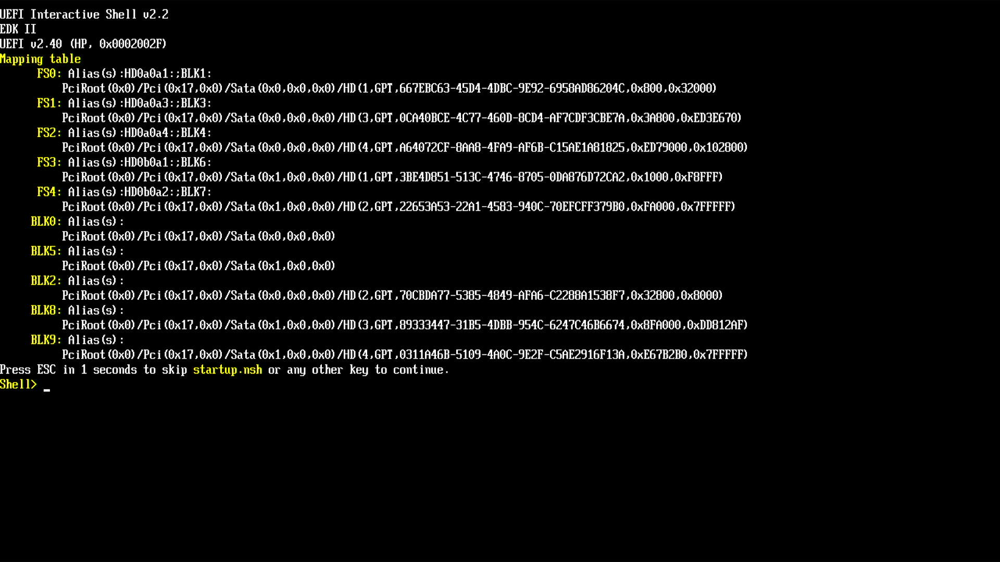
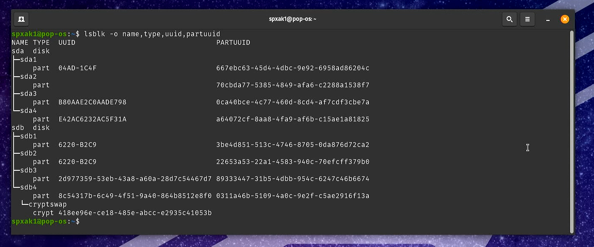
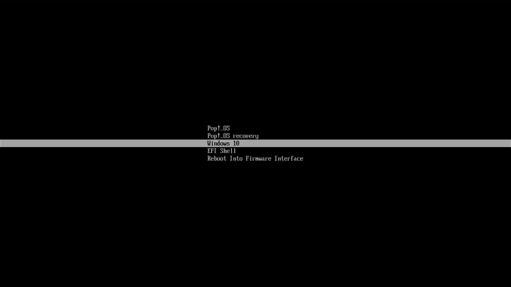

# Dual boot Windows with Pop!\_OS without copying Windows's efi files

Note: This is slightly advanced, but it is a more elegant solution to copying MS efi files over to Pop's ESP. **It comes with a caveat, see the [end](https://github.com/spxak1/weywot/edit/main/guides/efishelldualboot.md#50-caveat)!

A walk-through of this guide, not very well done, admittedly, and rather lengthy and with mistakes (it's unedited) can be watched here: https://youtu.be/UpoyCSyDXz4

## 1.0 What is this guide?

This is a guide to get to boot Pop with other OS, namely Windows 10/11 or any other distribution, on UEFI systems, that are already preinstalled, or where the user cannot figure out partitioning, or if encryption is used in Pop and as such other OS are on separate drives.

This guide is also the better solution if Pop!\_OS and other OS share the same drive.

### 1.1 Credit
All credit, once more, goes to the Archwiki and its [systemd-boot configuration guide](https://wiki.archlinux.org/title/systemd-boot). Many thanks to the collective effort.

## 2.0 Requirements

* A computer with two (or more) OS installed already
* Internet connection
* A camera (to take a screengrab)
* Basic knowledge of how to get the systemd-boot at boot
* Patience and will to learn, it's not easy

## 3.0 Principle of operation

### 3.1 The issue
Systemd-boot can only read files to boot from that are present on the same partition as its own efi stub. While Pop!\_OS makes a large enough ESP, and indeed Windows will use it if installed *after* Pop, if Windows is already installed, or if it lives on a different drive to Pop, then there is no Windows entry in the systemd-boot menu.

### 3.2 The workaround
The easiest thing is to simply copy Windows efi stub in Pop's ESP. This is the quickest way to get a menu entry for Windows on the systemd-boot menu. This has some advantages and some disadvantages:

#### 3.2.1 Advantages

* Zero configuration required
* The entry that appears is not a custom one, but the auto-windows entry which means:
* Holding **w** during boot, boots to windows and holding **l** boots to linux
* You can reboot to Windows from Pop, simply with ```sudo systemctl reboot --boot-loader-entry=auto-windows
* It works even when other drives are connected afterwards (see end note)

#### 3.2.2 Disadvantages

* It is a brute force method and involves mounting Windows's ESP which many users can mess up
* Copied files never change, although Windows may actually update its own at its ESP
* Not elegant (if that matters)

Having said all that, this is still the preferred dual boot method if you insist to keep install Windows first (as people still *wrongly* advise for Pop).

### 3.3 This method
This method makes use of the EFI shell, a shell that works early during boot, before the OS are loaded. With this shell, we can run scripts, and load an OS using its own efi files.

#### 3.3.1 The process
* System POSTs
* EFI shell loads
* Unlike systemd-boot, the EFI shell can see *all* FAT32 partitions
* The EFI shell loads an EFI file to boot an OS from any of those partitions

#### 3.3.2 What we need to do
* Install EFI shell
* Write the EFI shell script
* Add an entry to systemd-boot menu that points to that script

Let's do it

## 4.0 Configuration
Note: This guide assumes two OS, each *completely* on its own SSD drive. I will add later a version with two OS on the same SSD (although the slightly more experience users can adapt this one easily).

All the work is done from within Pop.

### 4.1 Install the EFI shell

Download the file from [here](https://github.com/tianocore/edk2/blob/UDK2018/ShellBinPkg/UefiShell/X64/Shell.efi)
This is a legitimate file, so if in doubt check it comes from tiancore's EDK2 project.

The file downloaded is named ```Shell.efi```. 
Move the file to ```/boot/efi```. **NOT** in ```/boot/efi/EFI```, but the ESP, which is ```/boot/efi```. 

You need root for that. Use ```sudo su```. **Be careful, you're root now!**

~~~
mv Shell.efi /boot/efi
cd /boot/efi
mv Shell.efi shellx64.efi
~~~

The last step is crucial as systemd-boot will not see the file with *correct* name, ```shellx64.efi``` and will automatically create an entry in the menu for it.

### 4.2 Reboot to the EFI shell

Bring up the menu (spam the space bar after POST) and select EFI Shell.

This will drop you to a screen like this:



What we need is to take a picture of this screen, and reboot to Pop.

#### 4.2.1 What is on this screen?
This is the shell (at the end there is a prompt and it can take commands, like a linux terminal, but that's for another day).
It starts by listing all the storage devices.
Devices named **FSX**, like FS0, FS1 etc, are partitions that the UEFI can see (i.e Fat32).
Devices named **BLKX**, like BLK0, BLK5 etc are block devices and/or partitions that the UEFI cannot see (ext4, ntfs, btrfs etc).

What we are after is the **alias** of the partition that holds Windows's ESP. We don't know which one it is, but it's one of either FS0, FS1, FS2, FS3, FS4. 

You can (if you understand some basics) figure out which one is the partition we're after. You can see that FS0, sits on SATA device 0x0, while FS3 and FS2 on SATA device 0x1. Which means the first is **sda** and the second **sdb**. Probably! So we will check with the partUUID quoted, which unlike all other notation used here is the **same** in all OS/UEFI etc.

### 4.3 Reboot to Pop

Bring up a terminal and check the partuuid with:

~~~
lsblk -o name,type,uuid,partuuid
~~~

It should look like this:



As expected the partuuid starting with **667ebc63** is indeed the one we're after. 

Note: If you can't tell why this is indeed Windows ESP, do ```lsblk -o name,fstype,size,partuuid``` and look for the vfat partition which is only 100MB large. 

So, back to the photo you took of the EFI shell, and you can see that this partuuid corresponds to the first entry, and the alias is **HD0a0a1**

### 4.5 Make the shell script

Change to root with ```sudo su``` (**Be careful**).

In ```/boot/efi``` create a file with the following content:

~~~
HD0a0a1:\EFI\Microsoft\Boot\Bootmgfw.efi
~~~

Save it as ```windows.nsh```. The ```.nsh``` extension is crucial, so spell it properly.
Note: The first part of the line is **your** partition alias. Mine was HD0a0a1, yours is probably different.

This is just a path to where windows efi file is, using the UEFI's alias, so that the EFI script can run it. We needed the partition alias for it, hence all the previous work.

### 4.6 Make the systemd-boot entry

Still as root, go to ```/boot/efi/loader/entries``` and create a file with the following:

~~~
title  Windows 10
efi     /shellx64.efi
options -nointerrupt -noconsolein -noconsoleout windows.nsh
~~~
 
Save it as (e.g) Windows.conf. This file is a standard menu entry for systemd-boot. You can understand that all it does is loading the shell, with the options to not show a console at any time while it (the shell) runs the script (which simply points to the Windows efi file). Simple.

**Done**

### 4.7 Reboot to check the menu

Bring the menu up, and you should now see something like this:



Select Windows 10 and try if it boots. If it returns back to the menu, you have a typo in one of the scripts. It should other wise work fine.

## 5.0 Caveat

This method is more elegant as Windows actually boots its own efi files, not the copies, and you don't have to copy anything over. But it has its minor drawbacks:

* No auto-windows entry, as such:
* You can't hold **w** to boot Windows or **l** to boot linux, so you have to hold **1-9** if you remember which one's which.
* Rebooting from Pop needs the name of the menu entry, not auto-windows in the command

**But the main disadvantage** is that if you connect a new drive, even if it's USB, the alias to the Windows ESP changes and the menu entry won't work. It will work as soon as you remove the USB drive, or if it is an internal drive connected permanently you need to find the new alias, and edit the shell script (the one liner). 

## 6.0 Dual boot Pop with other OS

If other linux distributions are installed with their one ESP*, you can use the exact same process to add them to Pop's systemd-boot menu. Only change will be in the EFI shell script which will need to point to their bootloader (commonly the grub efi stub) inside their ESP. 

\*If you intend intalling other linux distributions with Pop, you should do a custom installation of them, and select Pop's ESP to be used for their ```/boot/efi```. Don't forget to **NOT** format it.


