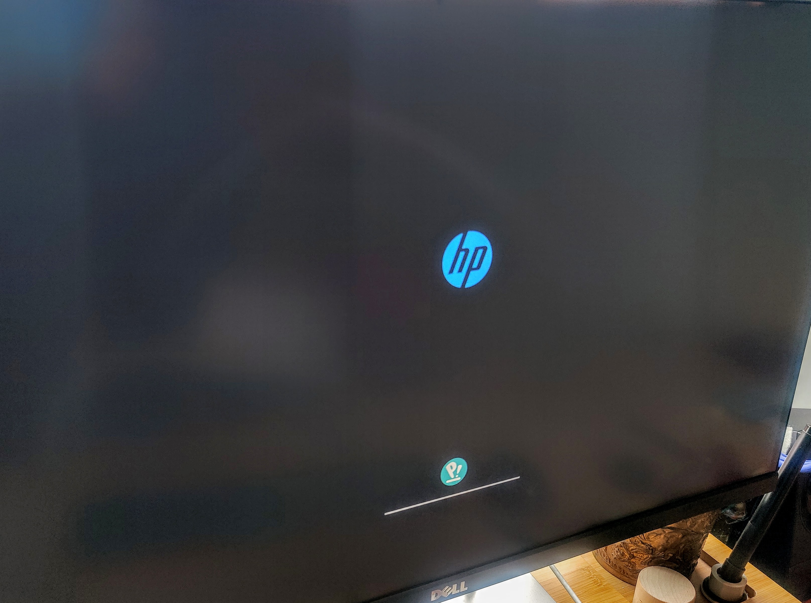

# Simple Pop_OS boot screen

This is a quick and lazy guide to convert the grey boot screen to a **OEM logo + Pop logo + progress bar boot screen**. 

**Note**: I don't know two-step syntax for plymouth, so this is the result of a quick figuring out how it works. You may well improve on it.

**Note**: This adds a good 2-3 seconds to the boot time, compared to the grey screen.

This is what it looks like:



## 1. Steps
Easy mod:
* Edit ```/usr/share/plymouth/themes/pop-basic/pop-basic.plymouth```
* Place the watermark picture (donwload from [here](https://github.com/spxak1/weywot/blob/main/assets/watermark.png) or below) in the same folder.


## 2. Execution
All steps require *root*, so **be careful**. Make a backup of any files you are going to edit, before editing them!

The following sequence is suggested:
~~~
otheos@brahe:~$ sudo su
[sudo] password for otheos: 
root@brahe:/home/otheos# cd /usr/share/plymouth/themes/pop-basic/
root@brahe:/usr/share/plymouth/themes/pop-basic# cp pop-basic.plymouth pop-basic.plymouth.bak
~~~

Here's my modified ```pop-basic.plymouth```. Changes are in **bold**.

<pre>
[Plymouth Theme]
Name=Pop Basic
Description=Re-Write of Pop!_OS decryption screen using two-step rather than pl>
ModuleName=two-step

[two-step]
Font=Fira Sans Regular 11
TitleFont=Fira Sans Regular 11
ImageDir=/usr/share/plymouth/themes/pop-basic
DialogHorizontalAlignment=.5
<b>DialogVerticalAlignment=.7</b>
TitleHorizontalAlignment=.5
<b>TitleVerticalAlignment=.682</b>
HorizontalAlignment=.5
<b>VerticalAlignment=.83</b>
WatermarkHorizontalAlignment=.5
<b>WatermarkVerticalAlignment=.8</b>
Transition=none
TransitionDuration=0.0
BackgroundStartColor=0x36322f
BackgroundEndColor=0x36322f
ProgressBarBackgroundColor=0x606060
ProgressBarForegroundColor=0xffffff
DialogClearsFirmwareBackground=true
MessageBelowAnimation=true
MessageBelowAnimationDistance=10
CursorAnimation=breath
CursorAnimationSpeed=7

[boot-up]
UseEndAnimation=false
<b>UseProgressBar=true</b>
<b>UseFirmwareBackground=true</b>

[shutdown]
UseEndAnimation=false
<b>UseFirmwareBackground=true</b>


[reboot]
UseEndAnimation=false
<b>UseFirmwareBackground=true</b>

[updates]
SuppressMessages=true
ProgressBarShowPercentComplete=true
UseProgressBar=true
Title=Installing Updates...
SubTitle=Do not turn off your computer
UseFirmwareBackground=true

[system-upgrade]
SuppressMessages=false
ProgressBarShowPercentComplete=false
UseProgressBar=true

[firmware-upgrade]
SuppressMessages=true
ProgressBarShowPercentComplete=true
UseProgressBar=true
Title=Upgrading Firmware...
SubTitle=Do not turn off your computer
</pre>

## 3. Changes

* Under **[two-step]** I have edited every part that includes the word **vertical**. That's that.
* Under **[boot]** I've added the last two lines.
* Under **[shutdown]** and **[reboot]** i've changed the last line to true.

## 4. Update the initramfs

For the changes to work you need to finish off with ```update-initramfs -u``` (as root) and reboot to see the difference.


