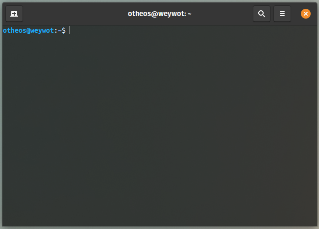
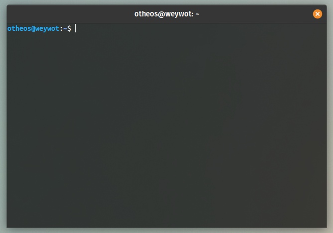
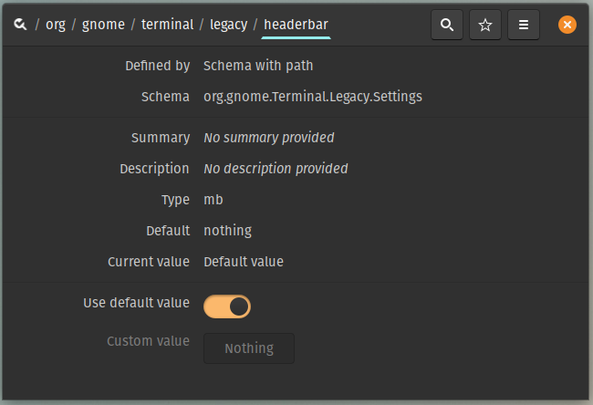
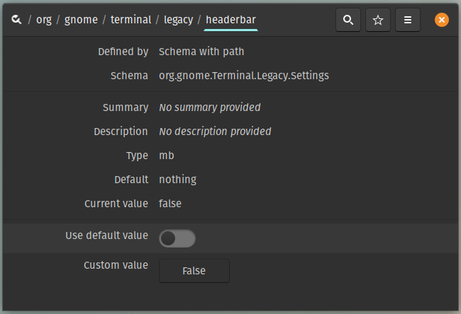

# How to reduce the header of the gnome-terminal in Pop!_OS

This only shaves of 10-15 pixels and removes Menu and Tabs buttons from the header. 

Right click anywhere in the terminal still gives you access to the **Menu** and **New Tab**.

1. Fire up ```dconf-editor```
2. Navigate to ```org/gnome/terminal/legacy/headerbar```
3. Disable ```Use default value```
4. Set ```Custome value``` to ```False```

Restart the terminal.

|Before|After|
|----|----|
|||
|||


