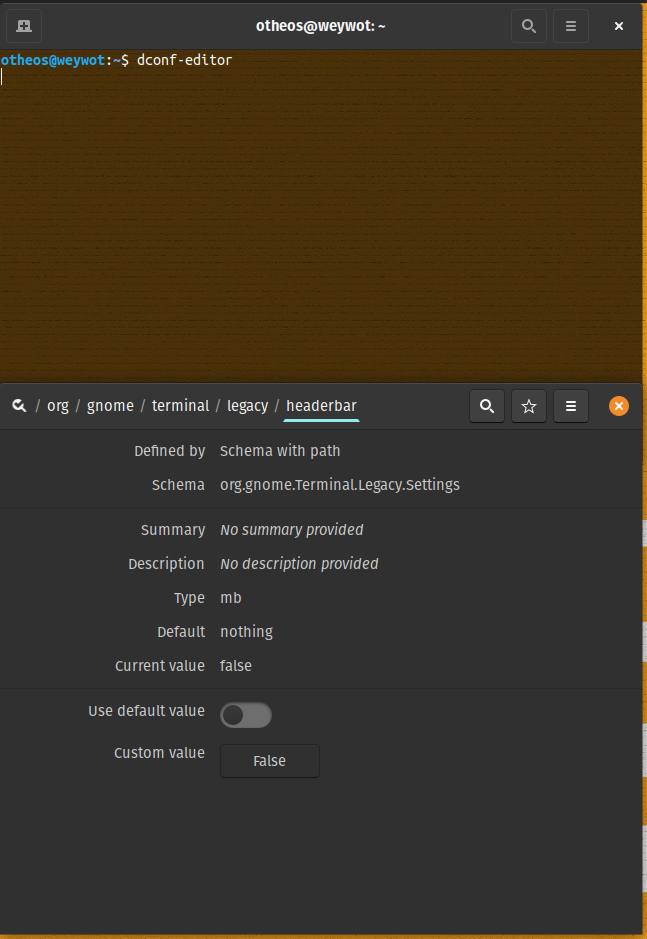

# How to decrease the header of the gnome-terminal in Pop!_OS

1. Fire up ```dconf-editor```
2. Navigate to ```org/gnome/terminal/legacy/headerbar```
3. Disable ```Use default value```
4. Set ```Custome value``` to ```False```

Restart the terminal.

Before:




After:


 
