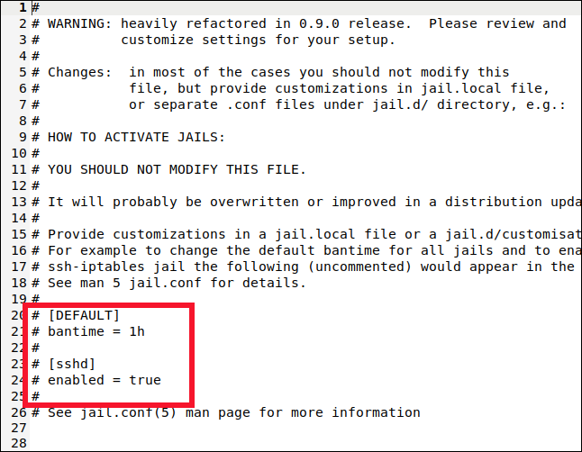
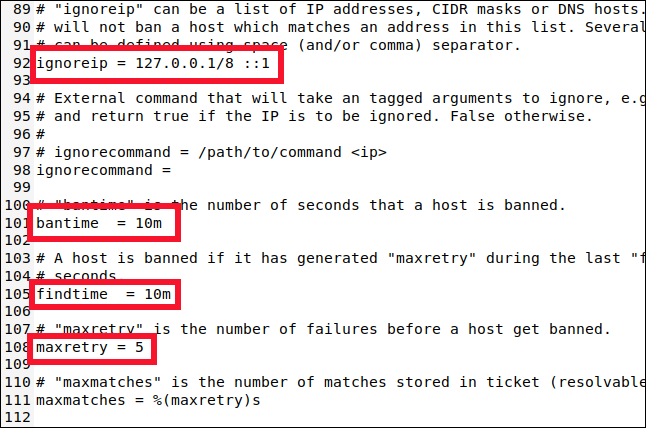
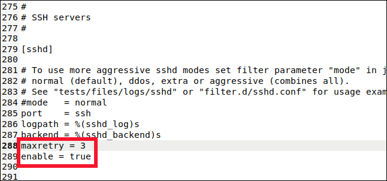

# Server SSH login with key and no 

With info from [here](https://erwinschleier.medium.com/connect-via-ssh-to-your-linux-server-7113695d8f80)
and for fail2ban, information from [here](https://www.howtogeek.com/675010/how-to-secure-your-linux-computer-with-fail2ban/)

Your server needs to have ```sshd``` installed. It normally is installed as a default.

## Configure the SSHD server

The config file is in ```/etc/ssh/sshd_config

The important bits are these:

~~~
HostKey /etc/ssh/ssh_host_rsa_key
HostKey /etc/ssh/ssh_host_ecdsa_key
HostKey /etc/ssh/ssh_host_ed25519_key

SyslogFacility AUTHPRIV

PermitRootLogin prohibit-password

AllowUsers otheos
Protocol 2
AuthorizedKeysFile	.ssh/authorized_keys

PermitEmptyPasswords no
PasswordAuthentication no

ChallengeResponseAuthentication no

GSSAPIAuthentication yes
GSSAPICleanupCredentials no

UsePAM yes

X11Forwarding yes

PrintMotd no

TCPKeepAlive yes
ClientAliveInterval 300
ClientAliveCountMax 6

AcceptEnv LANG LC_CTYPE LC_NUMERIC LC_TIME LC_COLLATE LC_MONETARY LC_MESSAGES
AcceptEnv LC_PAPER LC_NAME LC_ADDRESS LC_TELEPHONE LC_MEASUREMENT
AcceptEnv LC_IDENTIFICATION LC_ALL LANGUAGE
AcceptEnv XMODIFIERS

Subsystem	sftp	/usr/libexec/openssh/sftp-server
~~~

You need to enable and start the service: 

~~~
sudo systemctl enable sshd
sudo systemctl start sshd
~~~

This runs normally on port 22. You can change the port and then connect to it with ```ssh -p XX``` where XX is the new port.

## Remove passwords logins

This server now allows passwords log ins. This is a security issue if the ssh service is run externally. If it only runs internally its not a problem.

The passwords logins is controlled by this option in the pervious config file:

~~~
PasswordAuthentication no
~~~

To enable passwords logins you need to # this line.

While you have passwords log in open, you need to configure your keys. 

### Create keys on client

Each computer (or OS) that connects requires its own set of keys. A private (the client) and a public (the server). These are created on the client and copied to the server.

~~~
test@weywot:~$ cd .ssh
test@weywot:~$ ssh-keygen -t rsa
Generating public/private rsa key pair.
Enter file in which to save the key (/home/test/.ssh/id_rsa): id_pluto
Enter passphrase (empty for no passphrase): 
Enter same passphrase again: 
Your identification has been saved in id_pluto
Your public key has been saved in id_pluto.pub
The key fingerprint is:
SHA256:Cls9MT0UaAPEjqNxLmhLY3QIhZPTZibt3UvrZ18E8As test@weywot
The key's randomart image is:
+---[RSA 3072]----+
| *.  oo...o.     |
|B *   . +=       |
|.O.. + .E.=      |
| oo.= +. + +     |
|...=.o.oS . .    |
|.=o .+o. . .     |
|+ o....     .    |
| .    . o  .     |
|       o ..      |
+----[SHA256]-----+
~~~

Here I have named the file ```id_pluto``` to reflect the name of the client and know where it comes from. Any name is possible.
When asked for a passphrase, this is **only** for that key, and does not have to be the same as that of the user at any system (client or server).
You can use **no** passphrase to avoid having to type a password everytime you connect. But if you set one, that's the one you will need to type everytime you connect.

### Copy the public key to the server

*Note: you need to have ssh acces to the server via password at this point. You can disable it after this step is done.*

~~~
test@weywot:~$ ssh-copy-id -i ./id_pluto.pub otheos@ceres
~~~

Observe that the local user is ```test```, and the remote user I want to connect to is ```otheos```. 

You will be asked for that user's (```otheos```) password. This is **not** the passphrase, just the user passord to log in.

~~~
test@weywot:~$ ssh-copy-id -i ./id_pluto.pub otheos@ceres
/usr/bin/ssh-copy-id: INFO: Source of key(s) to be installed: "./id_pluto.pub"
/usr/bin/ssh-copy-id: INFO: attempting to log in with the new key(s), to filter out any that are already installed
/usr/bin/ssh-copy-id: INFO: 1 key(s) remain to be installed -- if you are prompted now it is to install the new keys
otheos@ceres's password: 
Warning: No xauth data; using fake authentication data for X11 forwarding.

Number of key(s) added: 1

Now try logging into the machine, with:   "ssh 'otheos@ceres'"
and check to make sure that only the key(s) you wanted were added.
~~~

Now you can disable password logins. Test you can connect.

## Secure the connection with fail2ban

Install it:

~~~
sudo apt-get install fail2ban

or

sudo dnf install fail2ban
~~~

Create the config file by copying the template (```.config```) to the ```.local``` (actual config) file.

~~~
sudo cp /etc/fail2ban/jail.conf /etc/fail2ban/jail.local
~~~

### Configure fail2ban

~~~
sudo pico /etc/fail2ban/jail.local 
~~~

We’ll look for two sections in the file: [DEFAULT] and [sshd]. Take care to find the actual sections, though. Those labels also appear near the top in a section that describes them, but that’s not what we want.

Find these lines: 



You’ll find the [DEFAULT] section somewhere around line 40. It’s a long section with a lot of comments and explanations.



Scroll down to around line 90, and you’ll find the following four settings you need to know about:

* ignoreip: A whitelist of IP addresses that will never be banned. They have a permanent Get Out of Jail Free card. The localhost IP address (127.0.0.1) is in the list by default, along with its IPv6 equivalent (::1). If there are other IP addresses you know should never be banned, add them to this list and leave a space between each one.
* bantime: The duration for which an IP address is banned (the “m” stands for minutes). If you type a value without an “m” or “h” (for hours) it will be treated as seconds. A value of -1 will permanently ban an IP address. Be very careful not to permanently lock yourself out.
* findtime: The amount of time within which too many failed connection attempts will result in an IP address being banned.
* maxretry: The value for “too many failed attempts.”

If a connection from the same IP address makes maxretry failed connection attempts within the findtime period, they’re banned for the duration of the bantime. The only exceptions are the IP addresses in the ignoreip list.

fail2ban puts the IP addresses in jail for a set period of time. fail2ban supports many different jails, and each one represents holds the settings apply to a single connection type. This allows you to have different settings for various connection types. Or you can have fail2ban monitor only a chosen set of connection types.

You might have guessed it from the [DEFAULT] section name, but the settings we’ve looked at are the defaults. Now, let’s look at the settings for the SSH jail.

#### Configure a jail

Jails let you move connection types in and out of fail2ban's monitoring. If the default settings don’t match those you want applied to the jail, you can set specific values for ```bantime```, ```findtime```, and ```maxretry```.

Scroll down to about line 280, and you’ll see the [sshd] section.



This is where you can set values for the SSH connection jail. To include this jail in the monitoring and banning, we have to type the following line:

```enabled = true```

We also type this line:

```maxretry = 3```

The default setting was five, but we want to be more cautious with SSH connections. We dropped it to three, and then saved and closed the file.

We added this jail to fail2ban's monitoring, and overrode one of the default settings. A jail can use a combination of default and jail-specific settings.

### Enable and test

~~~
sudo systemctl enable fail2ban.service
sudo systemctl start fail2ban.service
sudo systemctl status fail2ban.service
~~~

Then test:

~~~
[otheos@ceres ~]$ sudo fail2ban-client status
Status
|- Number of jail:	1
`- Jail list:	sshd
~~~

Now test the jail:

~~~
[otheos@ceres ~]$ sudo fail2ban-client status sshd
Status for the jail: sshd
|- Filter
|  |- Currently failed:	1
|  |- Total failed:	1
|  `- Journal matches:	_SYSTEMD_UNIT=sshd.service + _COMM=sshd
`- Actions
   |- Currently banned:	0
   |- Total banned:	0
   `- Banned IP list:
   ~~~
   
   Any banned IP's will appear above, but also here:
   
   ~~~
   sudo iptables -L
   ~~~
   
   You can un-ban them with:
  
  ~~~
  sudo fail2ban-client set sshd unbanip 192.168.5.25
  ~~~
  
  
  
   
   
